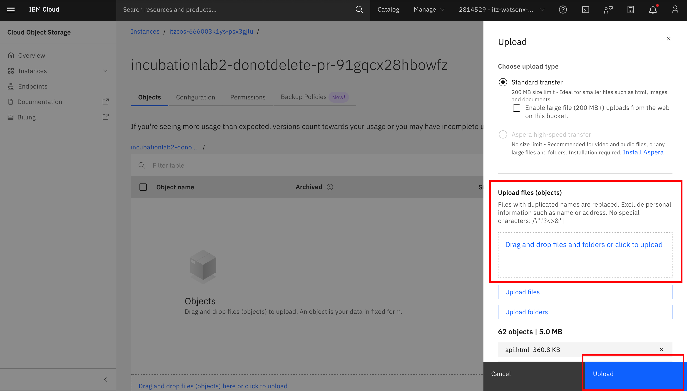
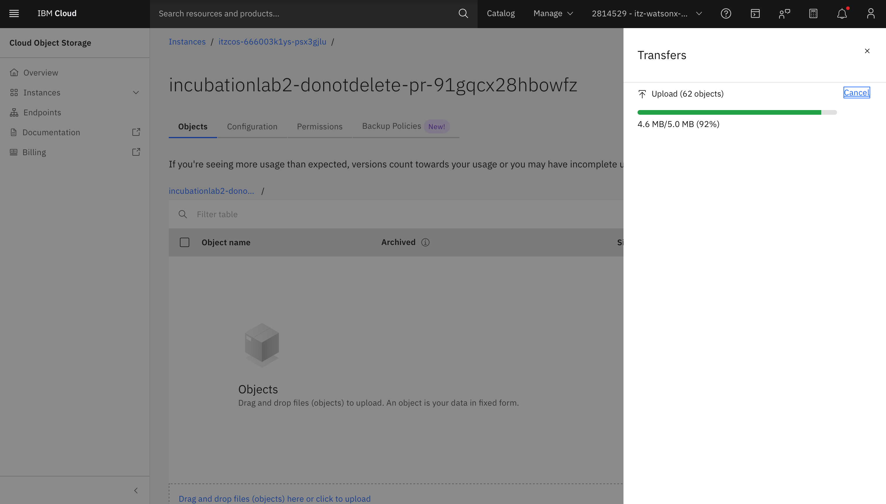
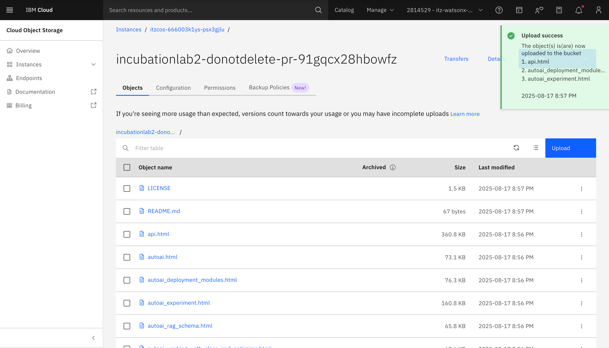
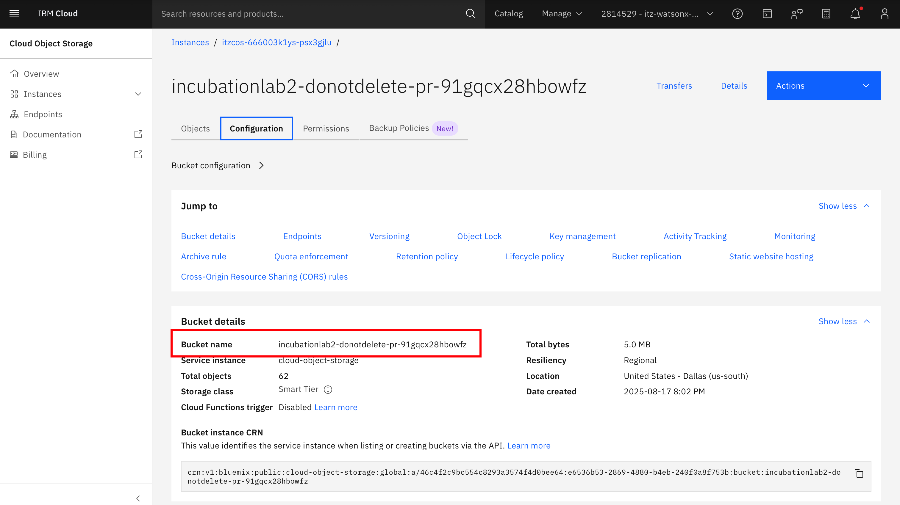

# Lab 2.1: Upload Document in Object Storage

## Document to be upload on object storage
The document that needed to be uploaded are in assets/data-input folder

## IBM Cloud 
1. Open IBM Cloud Account as below. Click the hamburger menu on the left, choose Resources List

2. In the resources list, there Storage which Object Storage where we will upload our certain type of documents

3. Choose the project watsonx you're in 

4. Upload the documents in the previously steps to there

5. The Document will be saved into Object Storage 
 

6. There will be notification if the document succesfully uploaded

7. Paste somewhere the credentials for bucket name

