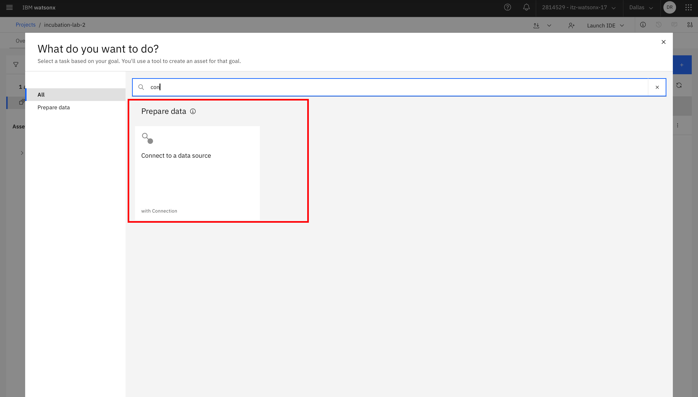
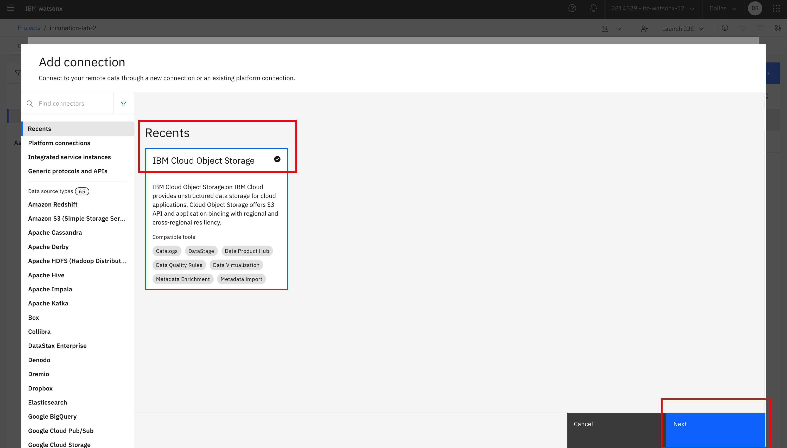
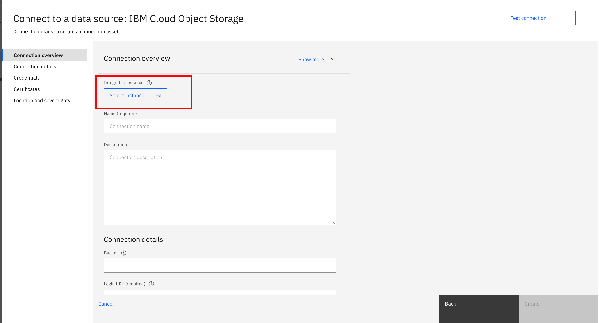
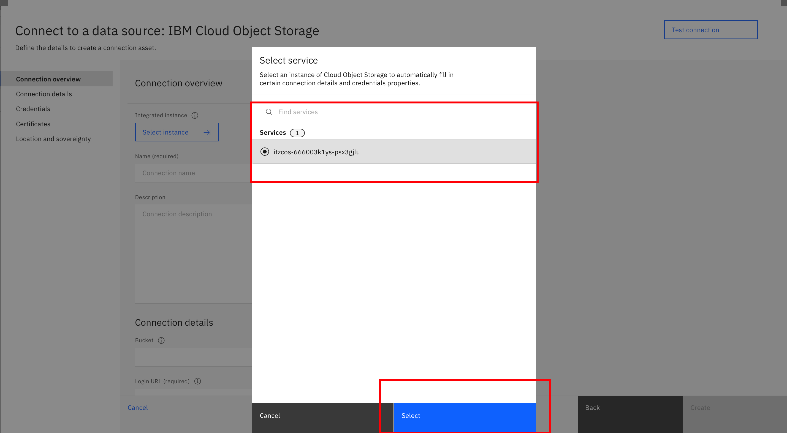
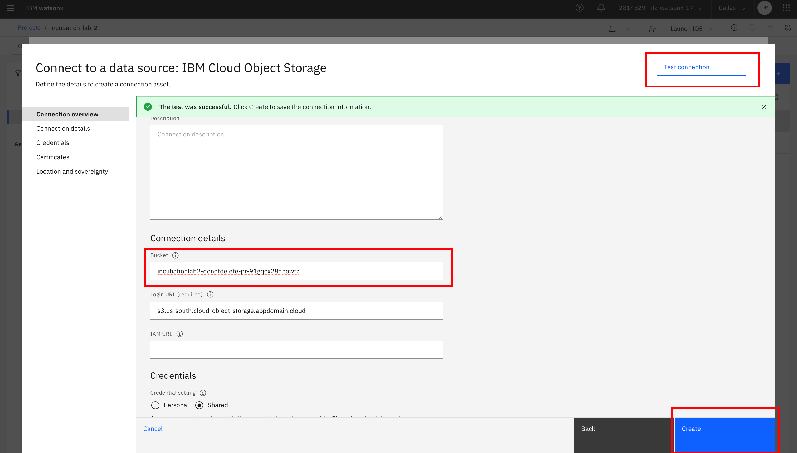

# Lab 2.2: Connect to Object Storage

## Create the connection to Object Storage
1. After uploaded the document to Object Storage, now we need to connect with it. Go to the Projects in Watsonx. Search the connect to a data source in the assets menu

2. Find IBM Cloud Object Storage in the menu 

3. Select the instances such as follows

4. Paste the bucket name earlier in the connection details such as follows

5. Test the connection, it will connected if the test connection is succesfully
