# Lab 1.3: Auto RAG
Congratulations we already create the data connection.

## Auto RAG
1.  Now we want to build auto RAG, click `assets` 

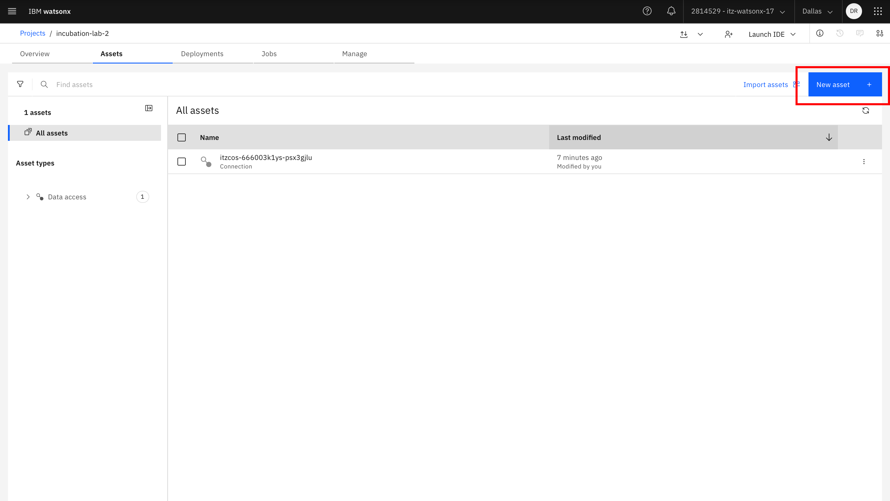

2. Search `building in machine learning or RAG solutions automatically` in the assets menu

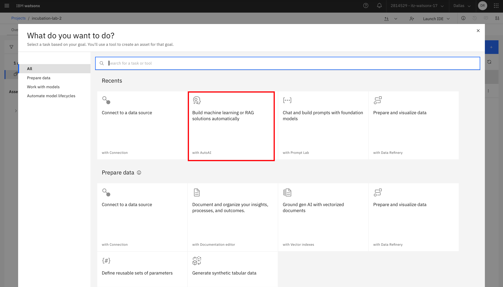

3. Fill the `Name` field such as follows 

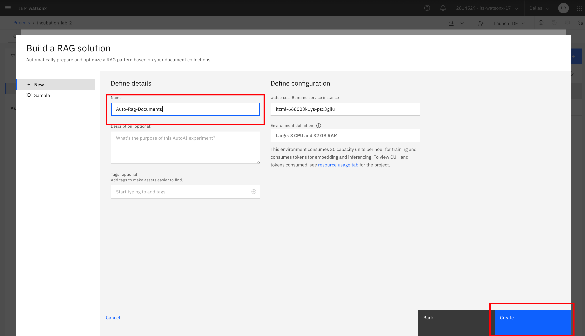

4. For the documents that needed to be upload, we choose `select from project` . Choose connection that we already create from previous steps

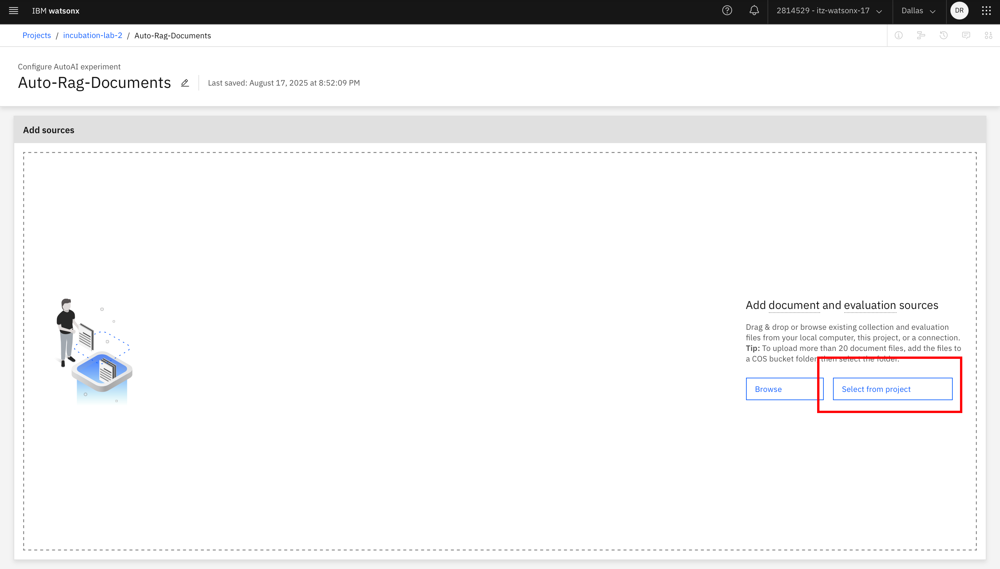

5. Choose some of the documents in Object Storage. This is the displayed of documents that needed to processing

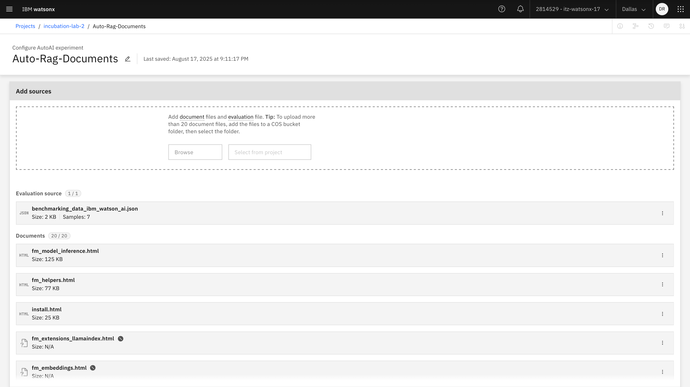

6. Scroll down, in here we can find how we want to store the database vector, watsonx can be integrated with milvus, chromaDB, etc. In this case we will use in memory vector, we dont connect it to milvus/chromaDB/elastic.

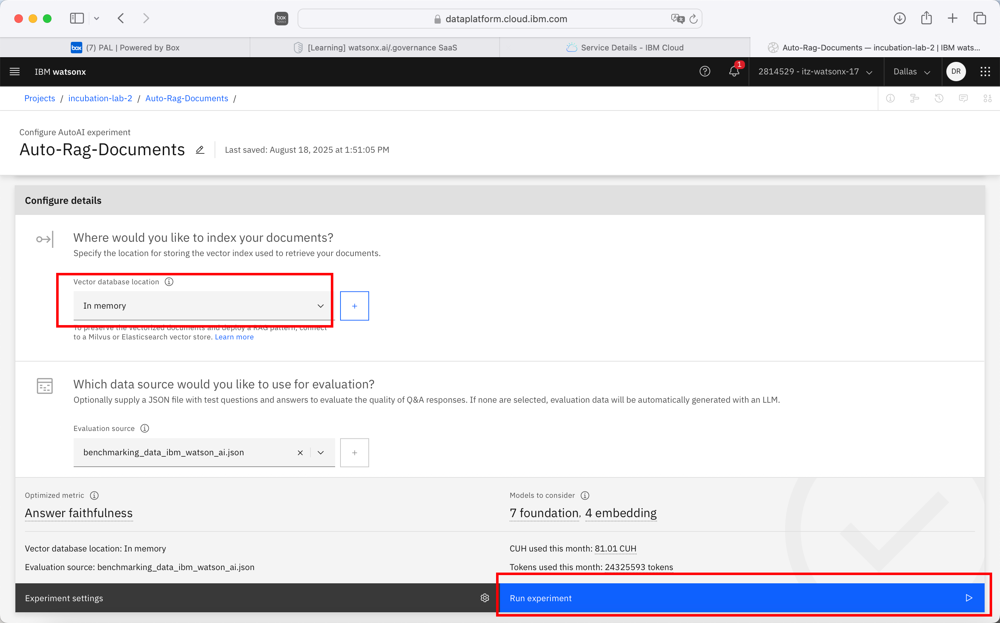

7. `Run the experiment`

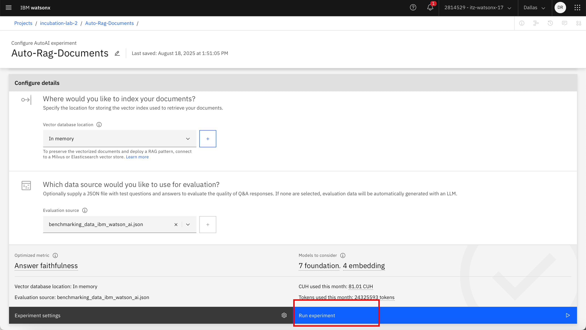

8. The Auto RAG will load and evaluate which metric configuration is the best to use. It will also rank which pipeline performs best.

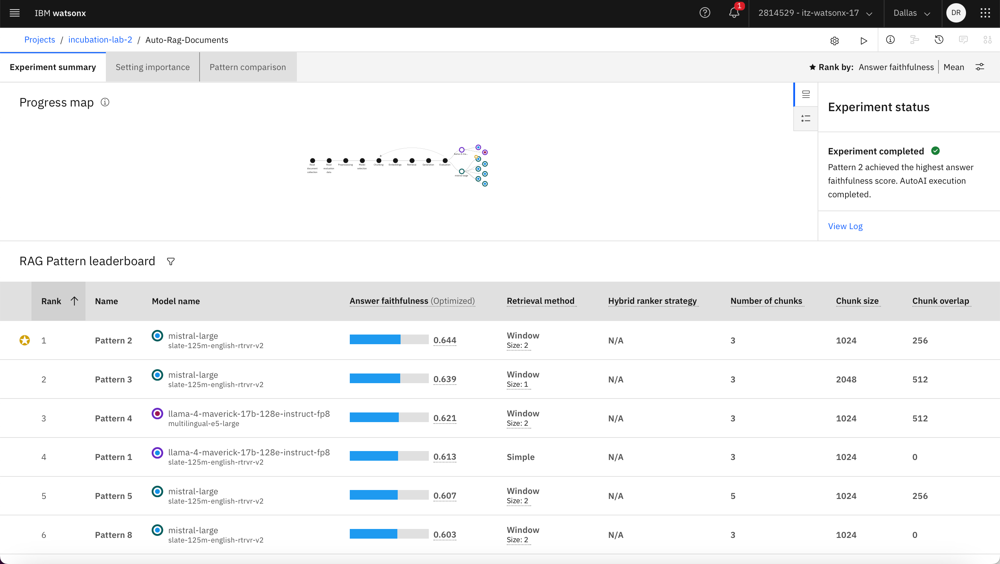

9. Open the pipeline that performs best, and then compare it with the others. Here, we can see pattern information such as the configuration of the vector store, chunking, embeddings, retrieval, generation, and even the sample QnA pairs.

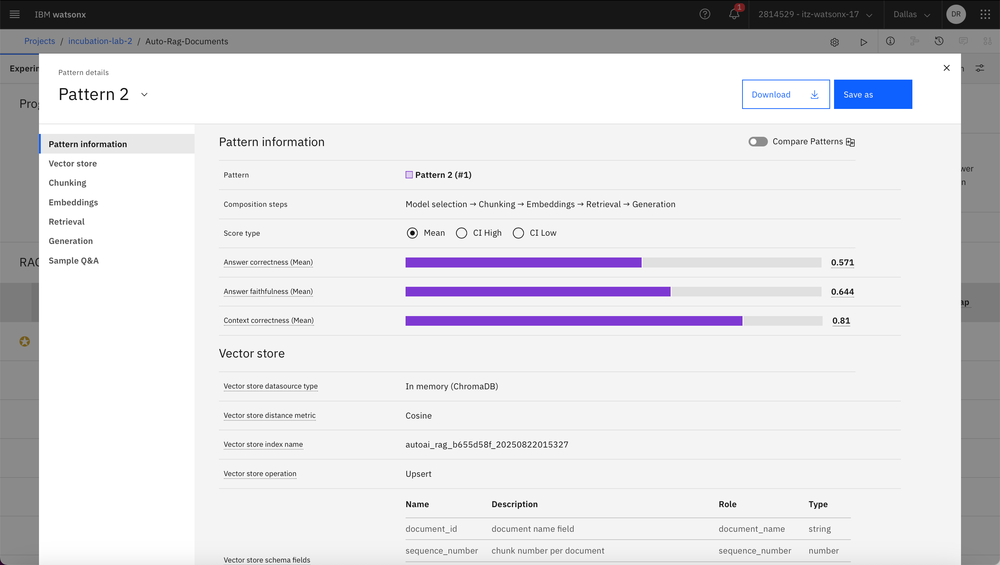

10. We can also choose which metric ranking we would like to see, whether it is based on correct answers, context correctness, or answer faithfulness.

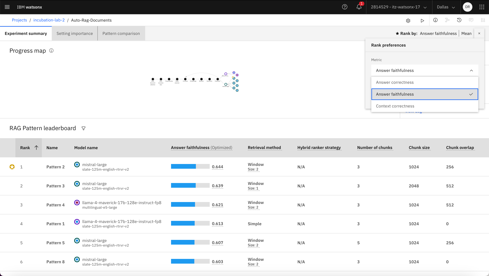

## Turn the model into AI Services
11. We can save the configuration and reuse it by saving the pipeline, as shown here

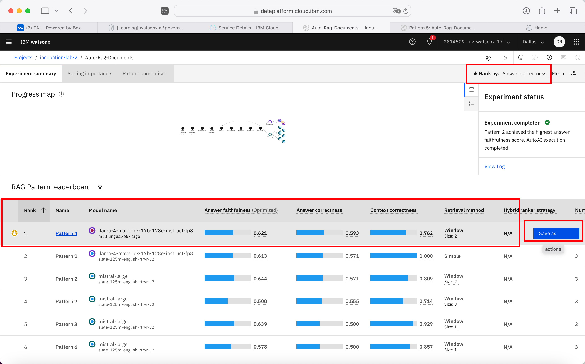

12. We can save it as a notebook or as an AI service; in this case, I will save it as an `AI service`.

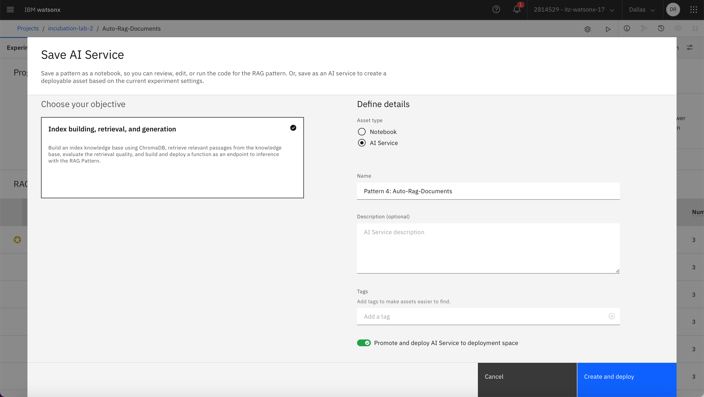

13. Add the deployment space where we want to deploy the AI service.

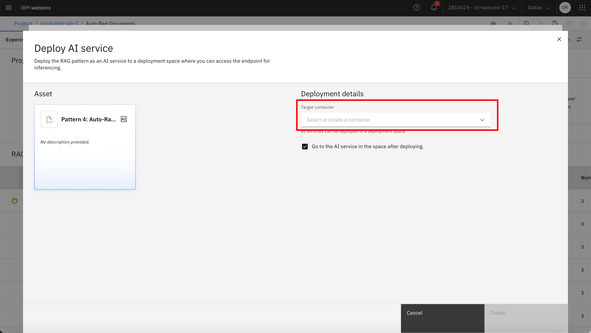

14. The AI service is already deployed.

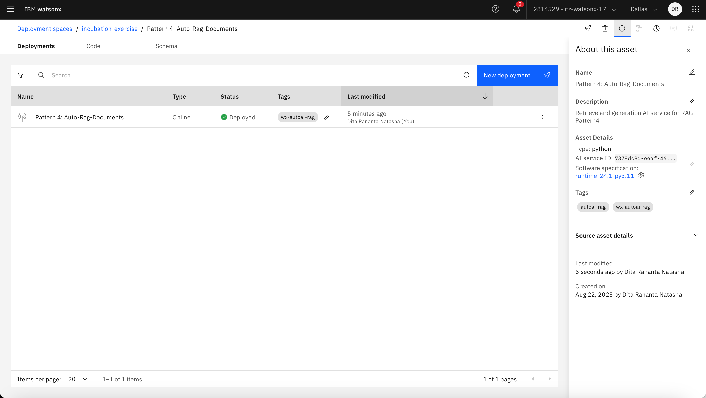

15. The AI Services can be consume through API with Curl, JavaScript, Python, etc 

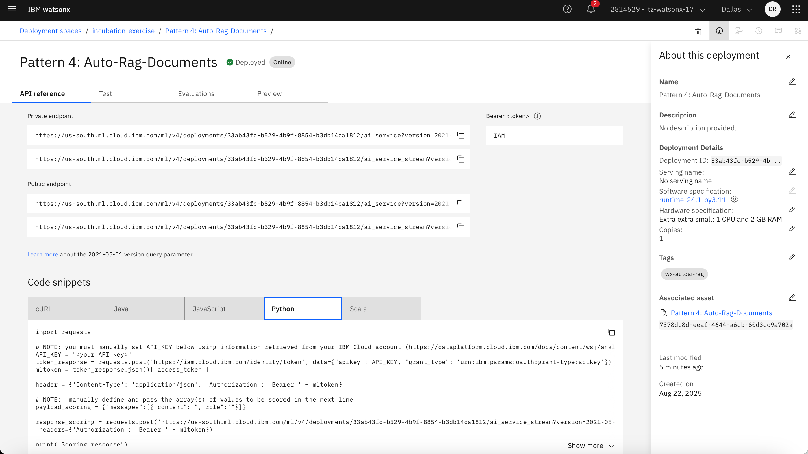

16. We can also do testing by choose `preview menu`. 

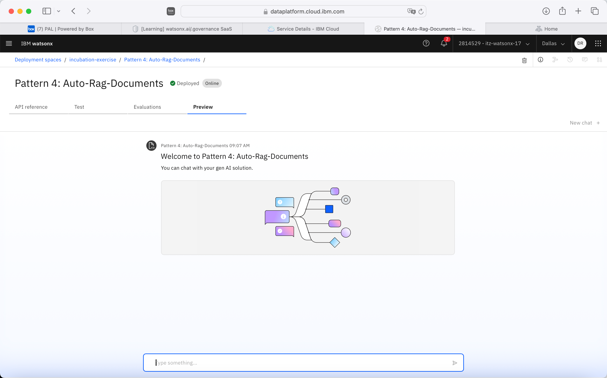

Sample Questions you could try
1. How to retrieve the list of model lifecycle data?
2. How to install ibm-watsonx-ai library?
3. How to retrieve the list of model lifecycle data?
4. What is method for get model inferance details?
5. How to get IAM APIkey

